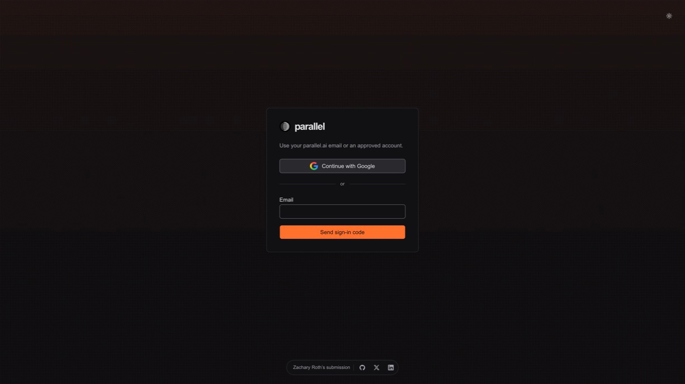
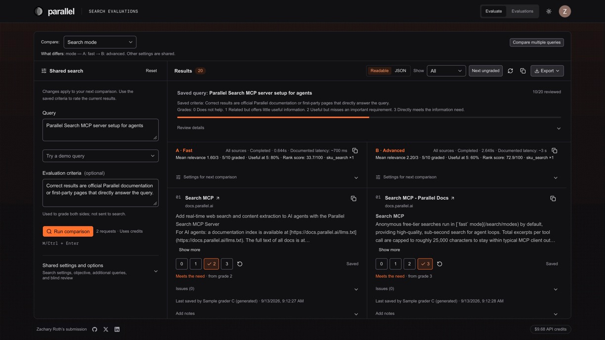
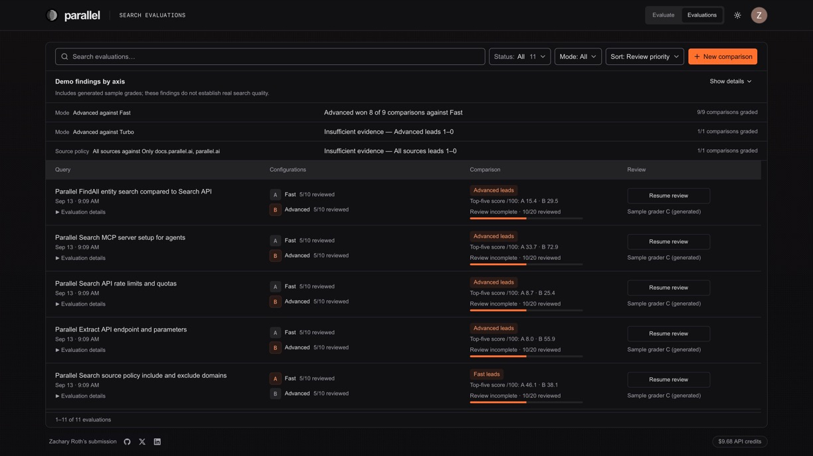

# Parallel Search evaluations

A web application for collecting human feedback on Parallel Search results, built as an interview
submission for Parallel. Users enter a query, grade each result, and return to saved evaluations.
Compare two search configurations side by side.

**[Open the live app](https://parallel-search-evaluations.vercel.app)** and sign in with a verified
`@parallel.ai` address using Google or an emailed verification code. The owner account also has access.

## Try it

Saved evaluations include **generated sample grades** for demonstration, not evidence of search quality.
Each new comparison uses real API credits: two calls, with a shared limit of 100 per UTC day.

1. Open **Evaluate** and enter a query.
2. Choose a search mode for configurations A and B.
3. Select **Run comparison** to see each result’s title, URL, and excerpts.
4. Grade each result from 0 to 3. Grades 2 and 3 mark a result correct for the query.
   Ratings save immediately; **Saved** confirms the change.
5. Open **Evaluations** to resume a review or inspect saved comparisons.

To add context, select issue tags or enter a note. Select **Save note** after editing a note.
To download an evaluation, open it and select **Export**, then choose JSON, CSV, or JSONL.

## Screenshots

Production app in dark mode.

### Login



### Evaluate



### Evaluations



## Feedback and comparison

Grades measure relevance to the query and saved criteria, not factual accuracy.

| Grade | Meaning | Verdict |
| --- | --- | --- |
| 0 | Does not help. | Does not meet the need |
| 1 | Related but offers little useful information. | Does not meet the need |
| 2 | Useful but misses an important requirement. | Meets the need |
| 3 | Directly meets the information need. | Meets the need |

Choose two modes from Turbo, Fast, Basic, and Advanced to compare using the same query. The interface shows grades, review
progress, rank scores, and latency. Optional blind review hides mode names during grading.
You can also compare source filters or other search settings, or run a comparison across multiple queries.
See [evaluation methodology](docs/evaluation-methodology.md) for metrics, pooled findings, and reviewer agreement.

## Implementation

Next.js 16 and React serve the interface and server routes. Neon Postgres stores search snapshots,
ratings, notes, and feedback history. Neon Auth manages sign-in; pages and APIs enforce access.
Parallel API credentials stay on the server.

Approved users share one workspace. See the [API contract](app/api/README.md) for saving,
concurrent edits, and retries.

## Run locally

You need Node.js, npm, a Parallel API key, and a Neon project with Postgres and Neon Auth configured.
Local development skips sign-in but uses the configured database and real Search API.
Use a separate development database to avoid changing deployed evaluations.

1. Install dependencies with `npm ci`.
2. Run the SQL in [schema.sql](schema.sql) against your development database using the Neon SQL Editor.
3. Create an untracked `.env.local`:

   ```dotenv
   PARALLEL_API_KEY=<your Parallel API key>
   DATABASE_URL=<your Neon Postgres connection string>
   NEON_AUTH_BASE_URL=<your Neon Auth URL>
   NEON_AUTH_COOKIE_SECRET=<at least 32 random characters>
   ```

4. Configure authentication using the [deployment guide](DEPLOYMENT.md).
5. Start the server with `npm run dev`.
6. Open [localhost:3000](http://127.0.0.1:3000) to view the evaluation workspace.

## Checks and documentation

```sh
npm test
npm run lint
npm run build
```

`npm test` uses mocked database and provider responses. Browser checks run with `npm run test:browser`
against the local development server, or `npm run test:built` after a production build.

- [Testing guide](TESTING.md): browser and database checks, including scratch database requirements.
- [Deployment guide](DEPLOYMENT.md): environment variables, authentication, and deployment checks.
- [API contract](app/api/README.md): persistence, validation, and concurrency behavior.
- [Scoring implementation](lib/scoring.ts): rubric and comparison metrics.
